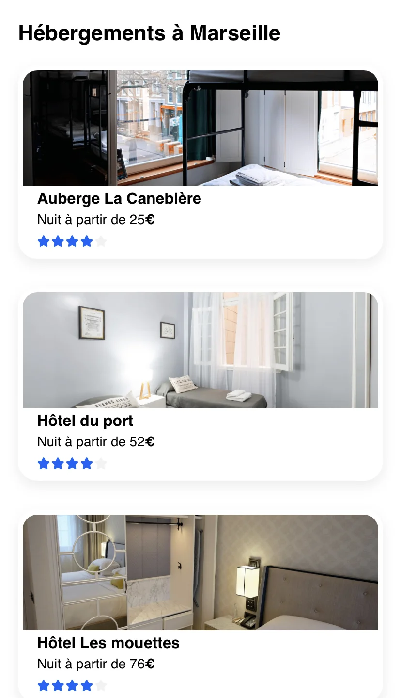

---

Ce projet peut vous intéresser si **vous commencez en tant que développeur web**, et souhaitez **apprendre les fondamentaux du développpement front-end.**

Tout premier projet du [parcours de développeur web d'_OpenClassrooms_,](https://openclassrooms.com/fr/paths/717-developpeur-web) Booki consiste en **l'intégration de maquettes Figma (version mobile, tablette et PC)**.



Réaliser ce projet permet d'apprendre les deux langages incontournables dans le web design : **HTML et CSS**.


---

# Booki

## Résultat du projet

### Page web

<div class="wpm blog-post-illustration-figure is-resized centered-figcaption">

</div>

<p align="center">
<strong>Cliquez sur le bouton ci-dessous pour découvrir la page web que j'ai réalisée et accédez-y dès maintenant !</strong><br /><br />
&nbsp;

:point_right: Lancer la démo !

</p>

---

### Code source (GitHub)


Cliquez sur l'encadré ci-dessous pour **accéder au code source de mon projet**.  

&nbsp;


---

## Pistes pour la réalisation du projet


**Je n'avais jamais écrit d'HTML, ni de CSS avant de me lancer dans ce projet.**  
Certains de mes choix sont **expérimentaux !**


**Afin de réaliser ce projet, il m'a fallu expérimenter en HTML et en CSS.**  
Cela a comporté son lot d'essais et d'erreurs, et de choix que je me permettrai de détailler dans cet article.


Je vous recommande de garder dans l'un de vos onglets cette page web :  
[:link: Maquettes Figma de Booki (PC, tablette, mobile)](https://www.figma.com/file/aen32jonHhD7JnIEL2b3sE/ARCHIVED-Maquettes-Booki-(desktop%2C-mobile%2C-tablette)?type=design&node-id=349-1)


### Bien commencer


Avant de commencer à travailler, je vous recommande de comprendre (dans les grandes lignes) la syntaxe du HTML.  
[:down_arrow: Vous trouverez en annexe une sélection de ressources pédagogiques](#liens-externes)


#### Avant de se lancer... (HTML)

<p align="left">

:down_arrow: Passer directement au CSS

</p>

Comme vous le constaterez, _l'indentation_ (espaces en début de ligne) est un sujet qui revient en permanence avec le HTML.  

**Pour ce projet, vous n'aurez pas particulièrement besoin d'extensions particulières dans votre éditeur de code.**  

Je vous recommande juste de vous assurer que votre *formatter* fonctionne correctement afin de pouvoir rapidement **indenter automatiquement** votre code.


Dans VS Code, utilisez la combinaison de touches suivante :  
`CTRL + Shift + P`\*, puis appelez la commande `Format Document`.  
_\* Le raccourci clavier sera `Commande + Shift + P` sur Mac._


<div class="wpm blog-post-illustration-figure is-resized centered-figcaption">

</div>

**Vous pouvez également vous épauler d'une IA :**
- [:link: ChatGPT,](https://chat.openai.com)
- [:link: Perplexity,](https://perplexity.ai)
- [:link: GitHub Copilot,](https://github.com/features/copilot)
- ou autre outil IA de votre choix.


**N'utilisez jamais du code que vous n'arrivez pas à raisonner !**  
N'hésitez pas à demander à votre agent conversationnel de reformuler sa réponse afin qu'elle soit plus simple, ou plus élégante, au moindre doute.


##### Retour aux fondamentaux


Vous trouverez toutes les ressources pédagogiques pour obtenir des fondamentaux solides en HTML [:down_arrow: dans les annexes de cet article de blog.](#liens-externes)  


**Néanmoins, je me permets deux petits conseils :**

<div class="wpm blog-post-illustration-figure is-resized centered-figcaption">

</div>



<p align="center" class="wpm fake-figcaption"><em>Découvrez les <strong>Emmet Shortcuts</strong>, et vous n'écrirez plus jamais votre code HTML de la même manière...</em></p>

##### De la maquette au HTML

[:link: Aujourd'hui, _OpenClassrooms_ fournissent un squelette de code HTML dans l'énoncé de Booki.](https://github.com/OpenClassrooms-Student-Center/booki-starter-code) Ce n'était pas le cas lorsque j'avais réalisé mon projet.  

Outre ce point de détail, l'idée reste la même : prendre la maquette, et **l'annoter pour pouvoir la transcrire en HTML.**

<div class="wpm blog-post-illustration-figure is-resized centered-figcaption">

</div>

- L'annotation de vos maquettes avec des balises HTML permet de **clarifier la structure et l'organisation de votre site web**. Cela facilite la compréhension de la conception de votre site.

- En annotant vos maquettes avec des balises HTML, vous créez **une référence claire pour le codage ultérieur**. Cela facilite la tâche des développeurs qui travaillent sur l'intégration, car ils comprennent immédiatement comment la conception doit être traduite en code.

##### La sémantique (SEO)

Voici l'ensemble des éléments de sémantique HTML que j'ai choisi d'utiliser pour ce projet **(chaque élément de la liste est cliquable et vous renverra directement vers une page de documentation)** :
- [:link: `<meta name="description" content="..." />`](https://fr.semrush.com/blog/basiques-seo-meta-description/)
- [:link: `<title>`](https://fr.semrush.com/blog/balise-title/)


Testez vos _meta description_ et _title_ grâce à un **simulateur de SERP**.  
[:link: Google SERP Simulator](https://mangools.com/free-seo-tools/serp-simulator)

- [:link: `<header>`](https://developer.mozilla.org/en-US/docs/Web/HTML/Element/header)
- [:link: `<nav>`](https://developer.mozilla.org/fr/docs/Web/HTML/Element/nav)
- [:link: `<main>`](https://developer.mozilla.org/fr/docs/Web/HTML/Element/main)
- [:link: `<section>`](https://developer.mozilla.org/fr/docs/Web/HTML/Element/section)
- [:link: `<article>`](https://developer.mozilla.org/fr/docs/Web/HTML/Element/article)
- [:link: `<button>`](https://developer.mozilla.org/fr/docs/Web/HTML/Element/button)
- [:link: `<aside>`](https://developer.mozilla.org/fr/docs/Web/HTML/Element/aside)
- [:link: `<footer>`](https://developer.mozilla.org/fr/docs/Web/HTML/Element/footer)
- [:link: hN (`<h1>`, `<h2>`, `<h3>`, `<h4>`, `<h5>`, `<h6>`)](https://developer.mozilla.org/fr/docs/Web/HTML/Element/Heading_Elements)
- [:link: Attribut `aria-label` pour le bouton de recherche](https://developer.mozilla.org/en-US/docs/Web/Accessibility/ARIA/Attributes/aria-label), afin que l'accessibilité sur mobile reste correcte


**Votre utilisation des balises `<ul>` et `<li>` peut également s'avérer sémantique !**  
[:link: **Discussion sur _Stack Overflow_ à ce sujet**](https://stackoverflow.com/questions/13416866/why-should-i-use-ul-li-in-my-html#:~:text=It%20is%20more%20semantically%20correct,on%20correct%20semantics%20to%20work.)

&nbsp;

Faites aussi attention lors de votre utilisation des balises `<section>` et `<article>`. Celles-ci doivent impérativement contenir au moins une balise `<hN>` afin de totalement respecter les _standards W3C_.


##### Le Validateur W3C (HTML)

Le **validateur W3C** est un outil essentiel, car il vous permettra de vérifier si votre **code HTML et CSS** respecte les normes établies par le _World Wide Web Consortium_ (W3C).

Cela vous aidera à **améliorer la qualité de votre code**, à améliorer la **compatibilité entre différents navigateurs** et rendre votre site web plus **accessible aux personnes handicapées**.

De plus, **le respect des normes du W3C peut contribuer positivement au référencement d'un site web** (SEO).

<p align="center">

:point_right: Vérifier mon HTML

</p>

---

#### Avant de se lancer... (CSS)

[:up_arrow: Avant de vous lancer, suivez très exactement les mêmes conseils que pour ce qui est de vos premiers pas en HTML tels qu'ils sont décrits ci-dessus dans cet article.](#avant-de-se-lancer-html)

---

##### Fondamentaux


Vous trouverez toutes les ressources pédagogiques pour obtenir des fondamentaux solides en CSS [:down_arrow: dans les annexes de cet article de blog.](#liens-externes)  


##### Sélecteurs

L'importance des sélecteurs CSS réside dans leur capacité à apporter **flexibilité et précision** lorsqu'il s'agit de styliser les pages web.  

En utilisant des sélecteurs bien choisis, il est possible de définir des styles pour des éléments individuels, des classes d'éléments ou des groupes d'éléments, ce qui permet **de personnaliser l'apparence d'une page de manière signifiante**.

<p align="center">

:point_right: Réviser les sélecteurs CSS

</p>

---


Ces sélecteurs peuvent également s'avérer **utiles pour l'écriture d'outils de _scraping_ ou de _tests automatisés_.**


Par exemple :
- [_Puppeteer_,](https://pptr.dev)
- [_Playwright_,](https://playwright.dev)
- [_Selenium + Beautiful Soup_](https://medium.com/ymedialabs-innovation/web-scraping-using-beautiful-soup-and-selenium-for-dynamic-page-2f8ad15efe25)...

---

##### Validateur W3C (HTML/CSS)

Nous avons déjà présenté le **validateur W3C** [:up_arrow: un peu plus tôt dans cet article.](#validateur-w3c-html)

Cependant, comme la page du validateur permettant d'activer ou non l'option « **CSS** » n'est pas évidente à trouver du premier coup...

<p align="center">

:point_right: Vérifier mon CSS

</p>

---

## Choix personnels


Il n'était pas autorisé d'utiliser _SASS_, ni de _Javascript_, ni de _bundler_...


### Rappels des contraintes (arbitraires) de l'exercice

Ce projet imposait la réalisation d'un projet **totalement vanilla**.  
C'est-à-dire qu'il ne fallait rendre que deux fichiers : le fichier `index.html` et le fichier `style.css`.  


**Cependant, je souhaitais tout de même produire un code relativement modulaire.**  


#### Concernant le HTML

Le code HTML de ce projet est assez classique, et une bonne compréhension du HTML est suffisante pour en lire le code.  
La seule particularité à noter est que j'ai ici fait un choix arbitraire quant à l'optimisation des images : j'ai fait le choix d'afficher les images **avec une meilleure qualité selon la largeur du viewport.**  

**Je souhaitais que les images de la page d'accueil soient correctement affichées sur ordinateur lorsque l'utilisateur zoome.**  


Plus l'on zoome, moins le viewport est large.


**Mais cela signifie aussi que les versions mobile/tablette doivent charger des images plus lourdes, car de meilleure qualité, car celles-ci sont également impactées (négativement) par ce choix, au sacrifice de conserver un bon affichage de la page d'accueil lorsque celle-ci est zoomée sur ordinateur.**  

[:link: Comprendre le Viewport dans le Web mobile](https://www.alsacreations.com/article/lire/1490-Comprendre-le-Viewport-dans-le-Web-mobile.html)


Pourtant, ce serait plutôt l'inverse que l'on chercherait à prioriser : **avoir la page la plus légère possible pour les téléphones**.


##### Une catastrophe en termes de _Page speed_ ?

**C'est donc l'impossibilité d'utiliser du Javascript m'a fait trancher pour ce choix.**  

Malgré ce choix, les _Pages speed_ restent très bons à l'heure où j'écris ces lignes.

<div class="wpm blog-post-illustration-figure is-resized centered-figcaption">

</div>

<div class="wpm blog-post-illustration-figure is-resized centered-figcaption">

</div>

##### Regarder ce que donnent les _benchmarks_ des _Pages speed_ plutôt que de partir sur des _a priori_

Cela est notamment lié au design de la version mobile où **seulement une image est chargée sur téléphone lors du _First Contentful Paint_**.  


Il n'y a pourtant même pas de notion d'optimisation à l'aide de _lazy loading_ sur les images dans ce code.  
**Et même une utilisation regrettable du _JPEG_, et sans _JPEG progressif_**.  


Aucune de ces images ne sont dans le *CSS* sous forme de *background image* : **elles sont bien toutes présentes dans des balises HTML**.

Par exemple :

```html
<a href="#">
  <div class="lodging-card-wrapper has-tweakers">
    <article class="lodging-card">
      <picture class="thumbnail">
        <source srcset="./images/hebergements/2_large/marcus-loke-WQJvWU_HZFo-unsplash.jpg"
          media="(max-width: 768px)">
        <source srcset="./images/hebergements/3_medium/marcus-loke-WQJvWU_HZFo-unsplash.jpg"
          media="(max-width: 1281px)">
        
      </picture>
      <div class="lodging-card-description">
        <h3 class="is-title">Auberge La Canebière</h3>
        <p class="price-p">Nuit à partir de 25<span class="is-fw-semibold">€</span></p>
        <div class="rating-container">
          <i class="fas fa-star is-checked" aria-hidden="true"></i>
          <i class="fas fa-star is-checked" aria-hidden="true"></i>
          <i class="fas fa-star is-checked" aria-hidden="true"></i>
          <i class="fas fa-star is-checked" aria-hidden="true"></i>
          <i class="fas fa-star is-unchecked" aria-hidden="true"></i>
        </div>
      </div>
    </article>
  </div>
</a>
```


J'ai une page **avec des images qui sont constamment en excellente qualité**.  
**Tout en honorant un _Page speed_ tout à fait décent**.  
**Sans Javascript ni intelligence d'optimisation particulièrement poussée.**


---

#### Concernant le CSS

**Bien qu'HTML et CSS ne soient pas considérés comme des languages de programmation**, et que je ne consacrerai pas mon article de blog à répondre à ce débat : **le CSS est à mon sens un langage tout à fait intéressant et sur lequel on retrouve de la technicité et de l'intelligence dans son écriture**.

##### Notions de Monkey patching et de modularisation

Comme on en a plutôt l'habitude en programmation : **le code CSS est lu de haut en bas**.  


Et tout comme j'en ai également eu l'habitude avec des langages de programmation dits _dynamiques_ : **il est possible de "Patcher" du code CSS en le réécrivant tout ou partie un peu plus bas que là où il a été déclaré pour la première fois.**  
[:link: _Monkey patching_.](https://fr.wikipedia.org/wiki/Monkey-Patch)


##### Simple rappel concernant la notion de surchage en CSS

Commençons par quelque chose que (presque) tout le monde sait. 

Cela fait partie des premières choses que l'on apprend concernant le CSS : **c'est le dernier choix que vous faites en CSS qui est pris en compte.**

[:link: How to Override CSS Styles](https://www.w3docs.com/snippets/css/how-to-override-css-styles.html)

_Commençons par un exemple très simple :_

```css
html p {
  color: red;
}

/* ... Monkey patch */
html p {
  color: blue;
}
```

**Le texte des paragraphes de ma page HTML sera bleu.**  
On a ici « Surchargé » la propriété `color` du sélecteur `html p` pour la faire passer de la valeur `red` à la valeur `blue`.


Dans le même principe : si l'on avait d'abord chargé un premier fichier CSS qui applique cette propriété `red`, puis un second qui applique finalement la propriété `blue`, on aurait donc modifié le comportement global de notre affichage **sans modifier le premier fichier**.


---

À présent que ce rappel a été fait : **que peut-on en tirer de réellement intéressant ?**  
**Quelle intelligence peut-on y appliquer ?**

##### Les variables en CSS

**Il est possible depuis CSS 3 d'utiliser des variables dans son code.**  

Imaginons que l'on parte sur le nuancier suivant :

<div class="wpm blog-post-illustration-figure is-resized centered-figcaption">

</div>

J'aurais donc **seulement cinq couleurs à utiliser sur l'intégralité du design d'un produit :**
- A : <span style="color:#005270; background-color:#000; padding: 5px; border-radius:2px; font-weight:500">#005270</span>
- B : <span style="color:#49C5F2; background-color:#000; padding: 5px; border-radius:2px; font-weight:500">#49C5F2</span>
- C : <span style="color:#00B0F0; background-color:#000; padding: 5px; border-radius:2px; font-weight:500">#00B0F0</span>
- D : <span style="color:#225B70; background-color:#000; padding: 5px; border-radius:2px; font-weight:500">#225B70</span>
- E : <span style="color:#008ABD; background-color:#000; padding: 5px; border-radius:2px; font-weight:500">#008ABD</span>

J'ai à présent deux possibilités :
- Écrire partout dans mon code, en dur, `#005270` dès lors que j'ai besoin de la couleur A (**pas bien !**)
- **Créer une variable `primary-color` et lui donner la valeur `#005270`, puis écrire `primary-color`.**

---

###### N'oubliez pas la notion de portée lexicale !


Comme dans d'autres langages de programmation, les variables du CSS sont « Scopées ».  
[:link: CSS variables: Scoping](https://blog.logrocket.com/css-variables-scoping/)


Cela permet d'appliquer une intelligence encore plus fine à son utilisation des variables.  

**Dans le cas d'un nuancier à appliquer sur l'intégralité d'un produit, c'est bien plus un handicap qu'une force.**

---

##### Le pseudo-élément `:root` en CSS

Le pseudo-élément `:root` va nous permettre de déclarer des _variables globales_.  
Ces variables sont utilisables dans tous les fichiers CSS d'un projet.  


Dans notre cas, nous n'avons qu'un seul fichier de feuille de style : le fichier `style.css`.  
Nos variables seront donc utilisables dans l'intégralité de ce fichier.  
**Gardez tout de même à l'esprit que dans le cas où vous ajouteriez de nouveaux fichiers CSS, ces variables y seraient également accessibles.**


Je vais donc pouvoir utiliser ce pseudo-élément en le considérant comme un module `Configuration` :

```css
:root {
  /* Configuration.globalLayout => font */
  --booki-font: 'Raleway';

  /* Configuration.chart => Static Colors */
  --booki-chart-primary: #0065FC;
  --booki-chart-bg-color: #F2F2F2;
  --booki-chart-sections-bg-color: white;
  --booki-chart-filter-border-color: #D9D9D9;

  /* Configuration.chart => FX Colors */
  --booki-chart-filter-btn-hover: #DEEBFF;
  --booki-inactive-menu-elm-indicator-color: transparent;
  --booki-active-menu-elm-indicator-color: var(--booki-chart-primary);
  --booki-chart-blue-btn-hover: var(--booki-chart-primary);

  /* ... */
}
```

À présent, si j'écris plus bas dans mon code CSS :

```css
html p {
  color: var(--booki-chart-primary);
}
```

Les paragraphes de ma page auront alors la couleur : `#0065FC`.

##### Une volonté personnelle de séparer la configuration et l'implémentation

**J'ai à présent mes variables globales dans mon pseudo-élément `:root`.**  

Je voudrais, immédiatement après dans mon code CSS, décrire la configuration globale de chacun de mes éléments.

**J'aurais bien aimé pouvoir séparer ces informations dans plusieurs fichiers CSS, puis jouer avec la _at-rule_ `@import` et un _bundler_ afin de pouvoir tout regrouper dans un seul fichier CSS...**


**Mais ce n'était pas possible !**  
Les contraintes imposées sur ce projet ne me le permettaient pas.


Afin de clarifier cette volonté dans mon choix de réalisation du projet, j'ai donc décidé d'appeler cette spécificité des _Tweakers_ dans mon code, et ajouté une classe `.has-tweakers` sur les éléments concernés.

_(Et ce n'était pas idéal, nous en rediscuterons.)_

Ainsi :

```css
/* Constants: Top level wrapper width */
#top-level-wrapper.has-tweakers {
  --_width: 1400px;
}

/* Constants: Header nav's deadzone, header's height and its bottom gap */
#header.has-tweakers {
  min-height: 65px;
  margin-bottom: 55px;
}

/* Mutables: Header navigation menu's colors (NOT on mouse-over) */
.header-nav.has-tweakers {
  --_menu-active-item-hyperlink-color: inherit;
  --_menu-active-item-border-top-color: var(--booki-inactive-menu-elm-indicator-color);
}

/* Mutables: Header navigation menu's colors (WHEN on mouse-over) */
.header-nav-item.has-tweakers:hover {
  --_menu-active-item-hyperlink-color: var(--booki-chart-primary);
  --_menu-active-item-border-top-color: var(--booki-active-menu-elm-indicator-color);
  border-top-width: var(--_border-top-width);
}

/* ... */
```

J'ai également fait le choix d'écrire sous forme de variables certaines spécifications.  
Ce qui m'a permis par exemple de **calculer dynamiquement la largeur du wrapper qui englobe tout le contenu de ma page web selon la largeur spécifiée sur la maquette (1400 pixels), et ma gestion d'état du _fond perdu_ de ma page.**

```css
/* Webpage Wrapper */
#top-level-wrapper {
  /* ... */
  max-width: calc(var(--_width) + var(--booki-bleed-current-state-value));
  /* ... */
}
```

Ici, la variable `--_width` n'est accessible que dans le contexte de `#top-level-wrapper` et de ses éléments enfants (principe de _scope_).

J'ai à présent un code CSS qui commence par :
- Définir des variables globales,
- Définir des _Tweakers_ qui permettent de m'adapter à la maquette, sans mêler le fond et la forme de mon code,
- Créer une logique de calcul interne (la notion de _gestion d'états_ sera expliquée plus tard).

Par la suite, mon code comportera la ligne :

```css
/* ⛔ Do NOT edit the code BELOW this line unless you know what you are doing */
```

Cela signifie que **je signale à mon utilisateur que les lignes ci-après du code seront plus techniques : il ne s'agit plus de _Tweakers_ que n'importe qui pourrait venir modifier sans provoquer des comportements à la fois inattendus et difficilement compréhensibles**.  

J'ai donc un code qui respecte une certaine **notion de séparation de configuration et d'implémentation.**

Par la suite, le code deviendra assez classique pour un utilisateur habitué du CSS.

##### Gestion d'états


Peut-on considérer les _media queries_ comme des _événements_ ?  
Et peut-on commencer à me rapprocher d'une logique de _gestion d'états_ ?


###### Cas d'application dans Booki

La maquette de Booki n'était pas très précise concernant l'œil de designer qu'il fallait lui apporter sur un point.  
Il était question d'une _largeur maximale de 1400 pixels_. Mais aucun aperçu concret de ce que donne le site sur un écran de 1920 pixels de large par exemple.  


**Plus flou encore** : selon que l'on regarde la maquette de la version ordinateur, tablette ou mobile, on constate que les marges sur les côtés changent.  


<div class="wpm blog-post-illustration-figure is-resized centered-figcaption">

</div>

<div class="wpm blog-post-illustration-figure is-resized centered-figcaption">

</div>

<div class="wpm blog-post-illustration-figure is-resized centered-figcaption">

</div>

Ce qui était attendu était de tout simplement laisser les côtés de la page transparents.  
Finalement, il aurait suffi de bêtement centrer la page et laisser un fond blanc, et l'illusion aurait été suffisante...


Mais en design, la notion de _marges_ et de _fond perdu_ n'est pas la même !
[:link: _There Will Be Bleed (and other design terms you should know)_](https://dar.uga.edu/2019/there-will-be-bleed-and-other-design-terms-you-should-know/)


C'est donc pour cette raison que j'ai décidé d'avoir une distinction explicite entre mon intégration des _marges_ et du _fond perdu_ de la page web. À présent, si j'applique un arrière-plan qui n'est pas blanc, je vois de façon évidente que cette spécificité a bien été comprise et appliquée.

<div class="wpm blog-post-illustration-figure is-resized centered-figcaption">

</div>

###### Implémentation d'une logique de largeur dynamique et de fond perdu

Dans mon pseudo-élément `:root`, je définis ma variable globale `--booki-bleed-current-state-value`, et je lui donne comme valeur initiale : `var(--booki-bleed-desktop)`. Pour rappel : nous sommes sur une intégration en _Desktop First_. 

`var(--booki-bleed-desktop)` vient de devenir la valeur de _fallback_ de `--booki-bleed-current-state-value`.  

À présent, je vais aller modifier cette variable dans mes _breakpoints_.

```css
/*** D. Breakpoints */
/* ✨ [§ D.1) Bleed Manager] */
@media (max-width: 992px) {
  :root {
    --booki-bleed-current-state-value: var(--booki-bleed-tablet);
  }
}

@media (max-width: 768px) {
  :root {
    --booki-bleed-current-state-value: var(--booki-bleed-mobile);
  }

  #content>.lodgings-section,
  #content>.activities,
  #top-level-wrapper>#header,
  #top-level-wrapper>#footer {
    padding: 0;
  }
}
```

---

Et _zouh_ ! :tada:

<div class="wpm blog-post-illustration-figure is-resized centered-figcaption">

</div>

<div class="wpm blog-post-illustration-figure is-resized centered-figcaption">

</div>

##### `.has-tweakers` et le retour de bâton des spécificités de sélecteurs en CSS

Imaginons que j'écrive :

```css
.filter-button.has-tweakers {
  /* ... */
  padding: .9rem 1.2rem .9rem .9rem;
  /* ... */
}
```

Puis que je décide de _monkey patch_ la valeur de cette propriété `padding` plus bas dans mon code...

```css
@media (min-width: 366px) and (max-width: 495px) {
  .filter-button {
    padding: .5rem .8rem .5rem .5rem;
  }
}
```

Et bien : **ça ne fonctionne pas !**  
`padding` reste à une valeur de `.9rem 1.2rem .9rem .9rem`.


Nous pouvons retrouver l'origine de ce problème grâce à cet outil.  
[:link: Calculer la spécificité de ses sélecteurs CSS](https://specificity.keegan.st)


<div class="wpm blog-post-illustration-figure is-resized centered-figcaption">

</div>


**Cela signifie que les propriétés que l'on écrit dans `.filter-button.has-tweakers` sont prioritaires sur celles que l'on écrit dans `.filter-button` !**  
Il s'agit d'une particularité dans la logique de Monkey Patch de CSS dont je n'avais pas parlé jusqu'à présent.


Aïe...  
C'est très embêtant.

Mais alors que faire ?
Également écrire `.filter-button.has-tweakers` dans mes media queries ?  

**Je trouve ce choix très ennuyeux**, car j'aimerais que lorsque je navigue de `.has-tweakers` en `.has-tweakers` dans mon fichier CSS à l'aide du raccourci clavier `CTRL + F`, je ne puisse pas **brutalement changer de contexte de configuration sans m'en rendre compte**.

J'ai donc à la place fait le choix de créer une nouvelle classe, `.enable-tweakers-bypass`.  

Ainsi, je peux à présent patcher **en contournant mon tweaker initial**, de façon explicite dans mon code :

```css
@media (min-width: 366px) and (max-width: 495px) {
  .filter-button.enable-tweakers-bypass {
    padding: .5rem .8rem .5rem .5rem;
  }
}
```

Cependant, **cela induit de devoir polluer mon code HTML avec une classe supplémentaire**.


Dans un projet dépourvu des contraintes initiales évoquées, **nous aurions pu éviter ces casse-têtes et simplement passer par un _bundler CSS_ afin de pouvoir être tout aussi modulaire, mais sans devoir induire un code aussi inutilement sophistiqué.**

&nbsp;

Si vous n'êtes pas sûr d'avoir bien compris la **notion de spécificité en CSS**, cette vidéo de Grafikart vous l'expliquera à merveille.  




---

Bravo !  
Vous avez terminé la lecture de cet article.

Si ce n'est pas déjà fait, vous pouvez regarder le résultat en lançant la démo de ce projet.


Cliquez sur le bouton ci-dessous pour **découvrir la page web que j'ai réalisée** et **accédez-y dès maintenant !**

<p align="center">
&nbsp;

:point_right: Lancer la démo !

</p>

Merci de m'avoir lu !

---

## Annexes

### Liens externes

- Workflow
  - [:link: :fr: Mettez en place votre environnement front-end (_OpenClassrooms_)](https://openclassrooms.com/fr/courses/6943241-mettez-en-place-votre-environnement-front-end)
  - [:link: :fr: Gérez du code avec Git et GitHub (_OpenClassrooms_)](https://openclassrooms.com/fr/courses/7162856-gerez-du-code-avec-git-et-github)
  - [:link: :fr: Corrigez vos bugs et trouvez une solution à vos problèmes de code (_OpenClassrooms_)](https://openclassrooms.com/fr/courses/8030706-corrigez-vos-bugs-et-trouvez-une-solution-a-vos-problemes-de-code)
  - [:link: :us: _Write code faster in VS Code with Emmet shortcuts_](https://www.youtube.com/watch?v=45eWEO0gRHI)

- Commencer HTML et CSS
  - [:link: :fr: Apprendre l'HTML (_Grafikart_)](https://www.youtube.com/watch?v=oEAuNzWXRjM&list=PLjwdMgw5TTLUeixVGPNl1uZNeJy4UY6qX)
  - [:link: :fr: Apprendre le CSS (_Grafikart_)](https://www.youtube.com/watch?v=PE8FQ6zihhw&list=PLjwdMgw5TTLVjTZQocrMwKicV5wsZlRpj)
  - [:link: :fr: Créez votre site web avec HTML5 et CSS3 (_OpenClassrooms_)](https://openclassrooms.com/fr/courses/1603881-creez-votre-site-web-avec-html5-et-css3)
  - [:link: :us: S'entraîner sur les sélecteurs CSS : _CSS Diner_](https://flukeout.github.io/)
  - [:link: :us: Calculer la spécificité de ses sélecteurs CSS](https://specificity.keegan.st)
  - [:link: :fr: Le modèle de boîte : _CSS Box Model_](https://developer.mozilla.org/fr/docs/Learn/CSS/Building_blocks/The_box_model)
  - [:link: :globe_with_meridians: Commencer à utiliser Flexbox : _Flexbox froggy_](https://flexboxfroggy.com/#fr)
  - [:link: :globe_with_meridians: Commencer à utiliser CSS Grids : _Grid garden_](https://cssgridgarden.com/#fr)
  - [:link: :us: Se perfectionner en CSS : _CSS Tricks_](https://css-tricks.com)

- Astuces de normalisation CSS
  - [:link: :fr: _Monkey patching_.](https://fr.wikipedia.org/wiki/Monkey-Patch)
  - [:link: :us: _CSS variables: Scoping_](https://blog.logrocket.com/css-variables-scoping/)
  - [:link: :us: _CSS variables: Scoping_](https://blog.logrocket.com/css-variables-scoping/)
  - [:link: :us: _How to Override CSS Styles_](https://www.w3docs.com/snippets/css/how-to-override-css-styles.html)
  - [:link: :us: _Delightful ways to write reusable CSS using subclasses_](https://medium.com/insider-inc-engineering/delightful-ways-to-write-reusable-css-using-subclasses-903e90c9cf87)
  - [:link: :fr: _(Flexbox) min-width: 0 is the new zoom: 1_](https://raphaelgoetter.wordpress.com/2016/11/09/flexbox-min-width-0-is-the-new-zoom-1/)
  - [:link: :fr: Comprendre le Viewport dans le Web mobile](https://www.alsacreations.com/article/lire/1490-Comprendre-le-Viewport-dans-le-Web-mobile.html)

- Notions de design
  - [:link: :us: Fond perdu : _There Will Be Bleed (and other design terms you should know)_](https://dar.uga.edu/2019/there-will-be-bleed-and-other-design-terms-you-should-know/)

- Optimisation du chargement des polices
  - [:link: :us: _The Fastest Way To Load Google Fonts In WordPress (Part 2)_](https://metabox.io/load-google-fonts-faster-wordpress/)
  - [:link: :us: _Reduce & Optimize Web Fonts For Page Speed_](https://pagespeedchecklist.com/optimize-fonts)

- Sémantique (HTML)
  - [:link: `<meta name="description" content="..." />`](https://fr.semrush.com/blog/basiques-seo-meta-description/)
  - [:link: `<title>`](https://fr.semrush.com/blog/balise-title/)
    - [:link: Google SERP Simulator](https://mangools.com/free-seo-tools/serp-simulator)
  - [:link: `<header>`](https://developer.mozilla.org/en-US/docs/Web/HTML/Element/header)
  - [:link: `<nav>`](https://developer.mozilla.org/fr/docs/Web/HTML/Element/nav)
  - [:link: `<main>`](https://developer.mozilla.org/fr/docs/Web/HTML/Element/main)
  - [:link: `<section>`](https://developer.mozilla.org/fr/docs/Web/HTML/Element/section)
  - [:link: `<article>`](https://developer.mozilla.org/fr/docs/Web/HTML/Element/article)
  - [:link: `<button>`](https://developer.mozilla.org/fr/docs/Web/HTML/Element/button)
  - [:link: `<aside>`](https://developer.mozilla.org/fr/docs/Web/HTML/Element/aside)
  - [:link: `<footer>`](https://developer.mozilla.org/fr/docs/Web/HTML/Element/footer)
  - [:link: hN (`<h1>`, `<h2>`, `<h3>`, `<h4>`, `<h5>`, `<h6>`)](https://developer.mozilla.org/fr/docs/Web/HTML/Element/Heading_Elements)
  - [:link: Attribut `aria-label` pour le bouton de recherche](https://developer.mozilla.org/en-US/docs/Web/Accessibility/ARIA/Attributes/aria-label)
  - [:link: **Discussion sur _StackOverflow_ concernant les balises `ul` et `li`**](https://stackoverflow.com/questions/13416866/why-should-i-use-ul-li-in-my-html#:~:text=It%20is%20more%20semantically%20correct,on%20correct%20semantics%20to%20work.)

### Captures d'écran

<div class="wpm blog-post-illustration-figure is-resized centered-figcaption">

</div>

<div class="wpm blog-post-illustration-figure is-resized centered-figcaption">

</div>

<div align="center">

</div>

<p align="center" class="wpm fake-figcaption">Captures d'écran de la <strong>version mobile</strong> de la page d'accueil de Booki que j'ai réalisée.</p>
