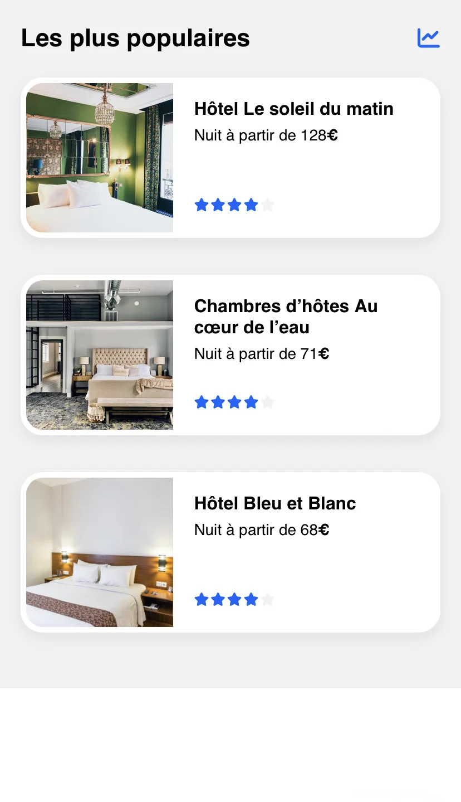

---

Ce projet peut vous intéresser si **vous commencez en tant que développeur web**, et souhaitez **apprendre les fondamentaux du développpement front-end.**

Tout premier projet du [parcours de développeur web d'_OpenClassrooms_,](https://openclassrooms.com/fr/paths/717-developpeur-web#?) Booki consiste en **l'intégration de maquettes Figma (version mobile, tablette et PC)**.



Réaliser ce projet permet d'apprendre les deux langages incontournables dans le web design : **HTML et CSS**.


---

# Booki

## Résultat du projet

### Page web



<strong>Cliquez sur le bouton ci-dessous pour découvrir la page web que j'ai réalisée et accédez-y dès maintenant !</strong>  
&nbsp;

:point_right: Lancer la démo !


---

### Code source (GitHub)


Cliquez sur l'encadré ci-dessous pour **accéder au code source de mon projet**.  

&nbsp;


---

## Pistes pour la réalisation du projet


**Je n'avais jamais écrit d'HTML, ni de CSS avant de me lancer dans ce projet.**  
Certains de mes choix sont **expérimentaux !**


**Afin de réaliser ce projet, il m'a fallu expérimenter en HTML et en CSS.**  
Cela a comporté son lot d'essais et d'erreurs, et de choix que je me permettrai de détailler dans cet article.


Je vous recommande de garder dans l'un de vos onglets cette page web :  
[:link: Maquettes Figma de Booki (PC, tablette, mobile)](https://www.figma.com/file/aen32jonHhD7JnIEL2b3sE/ARCHIVED-Maquettes-Booki-(desktop%2C-mobile%2C-tablette)?type=design&node-id=349-1#?)


### Avant de se lancer... (HTML)


Avant de commencer à travailler, je vous recommande de comprendre (dans les grandes lignes) la syntaxe du HTML :  
[:down_arrow: Vous trouverez en annexe une sélection de ressources pédagogiques](#liens-externes)



:down_arrow: Passer directement au CSS


Comme vous le constaterez, _l'indentation_ (espaces en début de ligne) est un sujet qui revient en permanence avec le HTML.  

**Pour ce projet, vous n'aurez pas particulièrement besoin d'extensions particulières dans votre éditeur de code.**  

Je vous recommande juste de vous assurer que votre *formatter* fonctionne correctement afin de pouvoir rapidement **indenter automatiquement** votre code.


Dans VS Code, utilisez la combinaison de touches suivante :  
`CTRL + Shift + P`\*, puis appelez la commande `Format Document`.  
_\* Le raccourci clavier sera `Commande + Shift + P` sur Mac._




**Vous pouvez également vous épauler d'une IA :**
- [:link: ChatGPT,](https://chat.openai.com#?)
- [:link: Perplexity,](https://perplexity.ai#?)
- [:link: GitHub Copilot,](https://github.com/features/copilot#?)
- ou autre outil IA de votre choix.


**N'utilisez jamais du code que vous n'arrivez pas à raisonner !**  
N'hésitez pas à demander à votre agent conversationnel de reformuler sa réponse afin qu'elle soit plus simple, ou plus élégante, au moindre doute.


#### Fondamentaux


Vous trouverez toutes les ressources pédagogiques pour obtenir des fondamentaux solides en HTML [:down_arrow: dans les annexes de cet article de blog.](#liens-externes)  


**Néanmoins, je me permets deux petits conseils :**





<em>Découvrez les <strong>Emmet Shortcuts</strong>, et vous n'écrirez plus jamais votre code HTML de la même manière...</em>

#### De la maquette au HTML

[:link: Aujourd'hui, _OpenClassrooms_ fournissent un squelette de code HTML dans l'énoncé de Booki.](https://github.com/OpenClassrooms-Student-Center/booki-starter-code#?) Ce n'était pas le cas lorsque j'avais réalisé mon projet.  

Outre ce point de détail, l'idée reste la même : prendre la maquette, et **l'annoter pour pouvoir la transcrire en HTML.**



- L'annotation de vos maquettes avec des balises HTML permet de **clarifier la structure et l'organisation de votre site web**. Cela facilite la compréhension de la conception de votre site.

- En annotant vos maquettes avec des balises HTML, vous créez **une référence claire pour le codage ultérieur**. Cela facilite la tâche des développeurs qui travaillent sur l'intégration, car ils comprennent immédiatement comment la conception doit être traduite en code.

#### Sémantique (SEO)

Voici l'ensemble des éléments de sémantique HTML que j'ai choisi d'utiliser pour ce projet **(chaque élément de la liste est cliquable et vous renverra directement vers une page de documentation)** :
- [:link: `<meta name="description" content="..." />`](https://fr.semrush.com/blog/basiques-seo-meta-description/#?)
- [:link: `<title>`](https://fr.semrush.com/blog/balise-title/#?)


Testez vos _meta description_ et _title_ grâce à un **simulateur de SERP**.  
[:link: Google SERP Simulator](https://mangools.com/free-seo-tools/serp-simulator#?)

- [:link: `<header>`](https://developer.mozilla.org/en-US/docs/Web/HTML/Element/header#?)
- [:link: `<nav>`](https://developer.mozilla.org/fr/docs/Web/HTML/Element/nav#?)
- [:link: `<main>`](https://developer.mozilla.org/fr/docs/Web/HTML/Element/main#?)
- [:link: `<section>`](https://developer.mozilla.org/fr/docs/Web/HTML/Element/section#?)
- [:link: `<article>`](https://developer.mozilla.org/fr/docs/Web/HTML/Element/article#?)
- [:link: `<button>`](https://developer.mozilla.org/fr/docs/Web/HTML/Element/button#?)
- [:link: `<aside>`](https://developer.mozilla.org/fr/docs/Web/HTML/Element/aside#?)
- [:link: `<footer>`](https://developer.mozilla.org/fr/docs/Web/HTML/Element/footer#?)
- [:link: hN (`<h1>`, `<h2>`, `<h3>`, `<h4>`, `<h5>`, `<h6>`)](https://developer.mozilla.org/fr/docs/Web/HTML/Element/Heading_Elements#?)
- [:link: Attribut `aria-label` pour le bouton de recherche](https://developer.mozilla.org/en-US/docs/Web/Accessibility/ARIA/Attributes/aria-label#?), afin que l'accessibilité sur mobile reste correcte


**Votre utilisation des balises `<ul>` et `<li>` peut également s'avérer sémantique !**  
[:link: **Discussion sur _Stack Overflow_ à ce sujet**](https://stackoverflow.com/questions/13416866/why-should-i-use-ul-li-in-my-html#:~:text=It%20is%20more%20semantically%20correct,on%20correct%20semantics%20to%20work.#?)

&nbsp;

Faites aussi attention lors de votre utilisation des balises `<section>` et `<article>`. Celles-ci doivent impérativement contenir au moins une balise `<hN>` afin de totalement respecter les _standards W3C_.


#### Validateur W3C (HTML)

Le **validateur W3C** est un outil essentiel, car il vous permettra de vérifier si votre **code HTML et CSS** respecte les normes établies par le _World Wide Web Consortium_ (W3C).

Cela vous aidera à **améliorer la qualité de votre code**, à améliorer la **compatibilité entre différents navigateurs** et rendre votre site web plus **accessible aux personnes handicapées**.

De plus, **le respect des normes du W3C peut contribuer positivement au référencement d'un site web** (SEO).


:point_right: Vérifier mon HTML


---

### Avant de se lancer... (CSS)

[:up_arrow: Avant de vous lancer, suivez très exactement les mêmes conseils que pour ce qui est de vos premiers pas en HTML tels qu'ils sont décrits ci-dessus dans cet article.](#avant-de-se-lancer-html)

#### Fondamentaux


Vous trouverez toutes les ressources pédagogiques pour obtenir des fondamentaux solides en CSS [:down_arrow: dans les annexes de cet article de blog.](#liens-externes)  


#### Sélecteurs

L'importance des sélecteurs CSS réside dans leur capacité à apporter **flexibilité et précision** lorsqu'il s'agit de styliser les pages web.  

En utilisant des sélecteurs bien choisis, il est possible de définir des styles pour des éléments individuels, des classes d'éléments ou des groupes d'éléments, ce qui permet **de personnaliser l'apparence d'une page de manière signifiante**.

> Ils peuvent également s'avérer **utiles pour l'écriture d'outils de _scraping_ ou de _tests automatisés_.** ([_Puppeteer_,](https://pptr.dev#?) [_Playwright_,](https://playwright.dev#?) [_Selenium + Beautiful Soup_](https://medium.com/ymedialabs-innovation/web-scraping-using-beautiful-soup-and-selenium-for-dynamic-page-2f8ad15efe25#?)...)


:point_right: Réviser les sélecteurs CSS


---

#### Validateur W3C (HTML/CSS)

Nous avons déjà présenté le **validateur W3C** [:up_arrow: un peu plus tôt dans cet article.](#validateur-w3c-html)

Cependant, comme la page du validateur permettant d'activer ou non l'option « **CSS** » n'est pas évidente à trouver du premier coup...


:point_right: Vérifier mon CSS


## Choix personnels

---

:construction: En cours de rédaction, repassez plus tard !

---

## Annexes

### Liens externes

- Workflow
  - [:link: :fr: Mettez en place votre environnement front-end (_OpenClassrooms_)](https://openclassrooms.com/fr/courses/6943241-mettez-en-place-votre-environnement-front-end#?)
  - [:link: :fr: Gérez du code avec Git et GitHub (_OpenClassrooms_)](https://openclassrooms.com/fr/courses/7162856-gerez-du-code-avec-git-et-github#?)
  - [:link: :fr: Corrigez vos bugs et trouvez une solution à vos problèmes de code (_OpenClassrooms_)](https://openclassrooms.com/fr/courses/8030706-corrigez-vos-bugs-et-trouvez-une-solution-a-vos-problemes-de-code#?)
  - [:link: :us: Write code faster in VS Code with Emmet shortcuts](https://www.youtube.com/watch?v=45eWEO0gRHI#?)

- Commencer HTML et CSS
  - [:link: :fr: Apprendre l'HTML (_Grafikart_)](https://www.youtube.com/watch?v=oEAuNzWXRjM&list=PLjwdMgw5TTLUeixVGPNl1uZNeJy4UY6qX#?)
  - [:link: :fr: Apprendre le CSS (_Grafikart_)](https://www.youtube.com/watch?v=PE8FQ6zihhw&list=PLjwdMgw5TTLVjTZQocrMwKicV5wsZlRpj#?)
  - [:link: :fr: Créez votre site web avec HTML5 et CSS3 (_OpenClassrooms_)](https://openclassrooms.com/fr/courses/1603881-creez-votre-site-web-avec-html5-et-css3#?)
  - [:link: :us: S'entraîner sur les sélecteurs CSS : _CSS Diner_](https://flukeout.github.io/#?)
  - [:link: :us: Calculer la spécificité de ses sélecteurs CSS](https://specificity.keegan.st#?)
  - [:link: :fr: Le modèle de boîte : _CSS Box Model_](https://developer.mozilla.org/fr/docs/Learn/CSS/Building_blocks/The_box_model#?)
  - [:link: :globe_with_meridians: Commencer à utiliser Flexbox : _Flexbox froggy_](https://flexboxfroggy.com/#fr#?)
  - [:link: :globe_with_meridians: Commencer à utiliser CSS Grids : _Grid garden_](https://cssgridgarden.com/#fr#?)
  - [:link: :us: Se perfectionner en CSS : _CSS Tricks_](https://css-tricks.com#?)

- Astuces de normalisation CSS
  - [:link: :us: _Delightful ways to write reusable CSS using subclasses_](https://medium.com/insider-inc-engineering/delightful-ways-to-write-reusable-css-using-subclasses-903e90c9cf87#?)
  - [:link: :fr: _(Flexbox) min-width: 0 is the new zoom: 1_](https://raphaelgoetter.wordpress.com/2016/11/09/flexbox-min-width-0-is-the-new-zoom-1/#?)

- Notions de design
  - [:link: :us: Fond perdu : _There Will Be Bleed (and other design terms you should know)_](https://dar.uga.edu/2019/there-will-be-bleed-and-other-design-terms-you-should-know/#?)

- Optimisation du chargement des polices
  - [:link: :us: _The Fastest Way To Load Google Fonts In WordPress (Part 2)_](https://metabox.io/load-google-fonts-faster-wordpress/#?)
  - [:link: :us: _Reduce & Optimize Web Fonts For Page Speed_](https://pagespeedchecklist.com/optimize-fonts#?)

- Sémantique (HTML)
  - [:link: `<meta name="description" content="..." />`](https://fr.semrush.com/blog/basiques-seo-meta-description/#?)
  - [:link: `<title>`](https://fr.semrush.com/blog/balise-title/#?)
    - [:link: Google SERP Simulator](https://mangools.com/free-seo-tools/serp-simulator#?)
  - [:link: `<header>`](https://developer.mozilla.org/en-US/docs/Web/HTML/Element/header#?)
  - [:link: `<nav>`](https://developer.mozilla.org/fr/docs/Web/HTML/Element/nav#?)
  - [:link: `<main>`](https://developer.mozilla.org/fr/docs/Web/HTML/Element/main#?)
  - [:link: `<section>`](https://developer.mozilla.org/fr/docs/Web/HTML/Element/section#?)
  - [:link: `<article>`](https://developer.mozilla.org/fr/docs/Web/HTML/Element/article#?)
  - [:link: `<button>`](https://developer.mozilla.org/fr/docs/Web/HTML/Element/button#?)
  - [:link: `<aside>`](https://developer.mozilla.org/fr/docs/Web/HTML/Element/aside#?)
  - [:link: `<footer>`](https://developer.mozilla.org/fr/docs/Web/HTML/Element/footer#?)
  - [:link: hN (`<h1>`, `<h2>`, `<h3>`, `<h4>`, `<h5>`, `<h6>`)](https://developer.mozilla.org/fr/docs/Web/HTML/Element/Heading_Elements#?)
  - [:link: Attribut `aria-label` pour le bouton de recherche](https://developer.mozilla.org/en-US/docs/Web/Accessibility/ARIA/Attributes/aria-label#?)
  - [:link: **Discussion sur _StackOverflow_ concernant les balises `ul` et `li`**](https://stackoverflow.com/questions/13416866/why-should-i-use-ul-li-in-my-html#:~:text=It%20is%20more%20semantically%20correct,on%20correct%20semantics%20to%20work.#?)

### Captures d'écran





Captures d'écran de la <strong>version mobile</strong> de la page d'accueil de Booki que j'ai réalisée.

